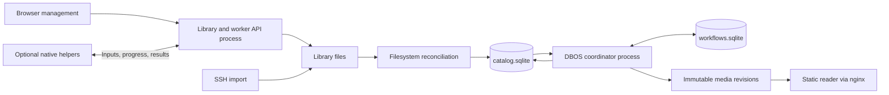

**Durable application architecture**

The service runs Python with two local SQLite databases and DBOS 3.0.0. The
reader remains a static site with its existing layout. One DBOS coordinator runs
on the server; an exclusive process lock enforces that rule. Optional native
helpers process assigned media operations over HTTP and can join or leave while
the server retains local fallback. They do not run DBOS or open its databases.
The databases must be on local storage. DBOS supports SQLite, although its
[documentation](https://docs.dbos.dev/python/tutorials/database-connection)
recommends PostgreSQL for distributed production deployments.



The catalog owns lesson identity, source identity, build intent, and the last
published lesson. DBOS owns scheduling, step checkpoints, recovery attempts, and
workflow outcomes. Catalog build status is a projection for the application UI,
not a second scheduler. The catalog records a random build ID before enqueueing;
the same ID is the DBOS workflow ID. Reconciliation can safely retry enqueueing
after a crash between the two database commits.

Each lesson revision has one workflow. It checkpoints source preparation, probe,
transcription, scenes, instructions, assets, assembly, and publication. The
ordinary `build` command uses those same stage callbacks without DBOS. Only the
`watch` service supplies the durable runner.

Workflow inputs contain a snapshot of processing settings and the source digest.
File operations, model calls, and catalog changes happen inside steps. Network
failures and retryable API responses get up to three step attempts with backoff.
Invalid input and local processing errors fail that lesson and remain available
for explicit retry. DBOS limits crash recovery to three attempts. The next
lesson can proceed independently.

**Optional processing helpers**

Schema v4 adds worker identities, single-use pairing codes, native task records
and fenced execution attempts. DBOS still owns lesson workflows; a task broker
inside each stage assigns supported native operations and records accepted results.
The server owns both SQLite files and all publication. Helpers receive immutable
inputs, report progress and upload checked results using scoped HTTP endpoints.

The coordinator admits one workflow without helpers and up to one plus the
available helper count, capped at four. Local expensive operations use one CPU
slot. Source preparation/probing/audio extraction have a separate single slot so
new helpers can receive work during a long local transcription. LLM calls are
limited separately to one. Each helper processes one operation at a time.

Within the existing `frames` DBOS stage, a bounded window admits up to eight
independent screenshot-gallery/clip jobs per lesson while media helpers are
available. Completed jobs refill the window immediately; a slow early job cannot
hold back later ready work. Local-only execution admits one job, and joining
helpers can expand the window. Each gallery preserves its own screenshot
deduplication sequence, and motion analysis remains a prerequisite of its clip.
Results merge in lesson order before asset cleanup and publication.

Batch threads receive native execution and cancellation context explicitly,
without inheriting DBOS's workflow context. The parent aggregates progress and
waits for all threads to stop before leaving the stage. Accepted task results
are reused on replay; failed batches fence their outstanding assignments while
coordinator shutdown preserves live remote work. Queue status exposes multiple
executions for one lesson and their step descriptions. Stage names and artifact
cache identities remain unchanged.

Assignments expire after 30 seconds without renewal. A failed/disconnected
attempt falls back locally; completed earlier operations and DBOS stages are
reused. Late results cannot replace the current attempt. Accepted outputs are
stored before checkpoint completion, so recovery can reuse an acknowledged
remote result. Server storage rejection is a capacity error rather than a reason
to repeat expensive processing.

The Workers page lists connected/offline computers, live native tasks, management
controls, and persistent contribution history. The queue links to the assigned
machine. Server heartbeat runs independently of filesystem reconciliation;
processing progress is distinct from liveness.

The connection page downloads a reproducible `.pyz` made from an allowlist of the
installed helper modules. It contains no application state or third-party Python
dependencies. Native FFmpeg/Whisper remain separate; a read-only `--check` and
platform instructions guide their setup. Shared protocol constants live outside
the server's database implementation so the bundle does not include that code.
Pairing codes are generated separately after prerequisite setup.

Schema v5 adds worker archiving. Archiving revokes access and releases active
assignments while keeping history; restoring only unhides the record. Permanent
deletion removes worker/contribution records only when unfinished current builds
do not need their assignments or accepted results. The library and published
revisions remain independent. Fresh pairing codes reuse a saved installation's
identity after verifying its original credential, so connection retries preserve
history instead of creating duplicate workers.

For protocol, setup, retention,
platform support and test coverage, see [DISTRIBUTED_WORKERS.md](DISTRIBUTED_WORKERS.md).

**Identity and artifacts**

Source size/mtime avoid hashing unchanged files on every scan. A changed or new
source is hashed with SHA-256. Its lesson UUID is independent of its filename,
title, and course. API renames preserve that UUID explicitly; external moves
preserve it when there is exactly one unambiguous matching missing source.
Identical copies imported together remain distinct lessons. External course
folder renames currently create a new course group while preserving matching
lesson IDs.

Before processing, the worker copies the source to an immutable snapshot and
verifies its digest. This costs additional disk space, but keeps active jobs and
published playback independent of subsequent overwrite, rename, or deletion.
The source snapshot is reused for later builds of the same bytes.

```text
library/                         user-managed source videos
state/catalog.sqlite             library metadata and build intent
state/workflows.sqlite           DBOS execution history and checkpoints
state/*.lock                     process/publication coordination
state/worker-results/            remote outputs retained for active builds/replay
work/lessons/<id>/<digest>/       disposable stage caches
site/_sources/<digest>/           immutable source snapshots
site/.staging/<build-id>/         unpublished generated media
site/_revisions/<build-id>/       committed generated media
site/<course>/<lesson-id>.html    atomically replaced public pages
site/status.json                 current worker heartbeat and lesson status
```

Generation never overwrites media used by a published revision. Publication
validates generated references, renames the staging directory into place, commits
the desired lesson record, and atomically replaces public text files. Startup and
ongoing reconciliation repair an interruption between the catalog commit and
page generation. A canceled, removed, or superseded build cannot publish. The
previous published revision remains usable when its replacement fails.

Reading state is namespaced by lesson identity and instruction content. A rename
preserves it; changing instructions gives a new namespace so completion does not
silently attach to unrelated steps. This does not yet implement cross-device sync
or migrate ambiguous old slug-only localStorage keys.

**Library organization**

Schema version 2 adds nullable title overrides to lessons and optional positions
to courses/lessons. Existing databases migrate transactionally. Source filenames
(without extensions, including numeric prefixes) supply default lesson titles;
the generated title becomes the short description. Ordering defaults to natural
source order until explicitly changed. New items append after a custom order.

`GET /api/catalog` returns the editable library and an organization revision.
`POST /api/catalog/courses/<id>/title` and
`POST /api/catalog/lessons/<id>/title` update display metadata. A null lesson title
restores its filename. `POST /api/catalog/courses/order` orders courses, while
`POST /api/catalog/courses/<id>/order` orders that course's lessons. These requests
carry the complete ordered `ids` list, or `mode: "source"` to reset ordering, plus
the revision loaded by the client. Missing, duplicate, foreign, and stale items
are rejected before modifying any positions.

The new publication module can render metadata changes in the API process, under
the same catalog lock as the worker. Source files, lesson IDs, URLs, instruction
state, and build intents remain intact. The Library page supports title editing,
up/down controls, moving to a numbered position, order resets, and search. The
course reader uses a vertical list with previous/next navigation.

**Running locally**

```sh
nix develop

# Terminal 1: durable worker, also creates the initial site.
v2w watch ./library -o ./site --work ./work --state ./.v2w-state --llm heuristic

# Terminal 2: static reader and management endpoints.
v2w serve ./site --library ./library --state ./.v2w-state

# Inspect jobs and use a lesson ID returned by the listing.
v2w jobs list --state ./.v2w-state
v2w jobs retry LESSON_ID --state ./.v2w-state
v2w jobs cancel LESSON_ID --state ./.v2w-state
```

Choose an LLM backend in place of `heuristic` for authored instructions. For a
separate API behind nginx, run
`v2w api ./library --state ./.v2w-state --port 8765`. The NixOS module now runs
`video-to-website` and `video-to-website-api` as separate services so processing
restarts do not terminate uploads. The optional `watch --api-port` convenience
mode still shares a process and does not have that isolation.

The homepage links to `queue.html`, which shows the full queue, positions,
processing stages, search, status filters, and per-lesson retry/cancel controls.
It reads the catalog directly through `GET /api/jobs`, retaining a read-only
`status.json` fallback when the API is unavailable. `GET /api/jobs`
returns the current job projection; `POST /api/lessons/<id>/retry` records a new
build intent and `POST /api/lessons/<id>/cancel` requests cancellation. ffmpeg and
Whisper subprocesses check cancellation while running and terminate their process
group. An in-flight synchronous LLM call may finish before cancellation takes
effect; its result cannot subsequently publish.

**Migration, maintenance, and boundaries**

Upload capacity is managed by `StorageManager`, independently of the lesson
catalog. It accepts named `StorageLocation` roots with free-space buffers. The
current API registers the primary library as `library`; adding actual multi-root
import/routing remains future work. Locations on one filesystem share reservations
and the largest applicable buffer, while separate filesystems have independent
capacity. The storage response is a list of locations plus the selected upload
destination, so the UI does not need to assume a single pooled disk.

`GET /api/storage?course=...` reports disk free/used/total bytes, the buffer, bytes
reserved for incoming data, and currently available upload capacity. The default
buffer is 1 GiB (`--min-free-gib` / NixOS `minFreeGiB`). Every PUT reserves its full
incoming size before reading its body. Already written bytes count as actual disk
usage and are subtracted from the remaining reservation. Replacements reserve the
new file's full size because the old source remains until atomic commit.

Reservation records live under `state/storage/`, or `.storage/` within a standalone
library. Each record is held by an OS file lock for the lifetime of its upload,
and a separate lock serializes capacity checks and writes across API processes.
Closing an upload releases its reservation; after a crash, the next capacity check
reclaims unlocked records and their abandoned temporary files. Active transfers
do not expire based solely on time. Each chunk and final commit recheck free space
in case the worker or another program has consumed it. This is upload admission
control, not a filesystem quota on other writers or future generated artifacts.

Schema version 3 adds a `build_progress` table for live measurements. These are
telemetry inside an existing DBOS step, not new workflow checkpoints. Writers are
throttled to roughly once a second; each stage attempt starts a fresh measurement,
and an old/cancelled stage cannot overwrite current progress. Updating telemetry
does not reset the stage's elapsed time or affect the library-edit revision.

The subprocess wrapper drains stdout and stderr concurrently on the workflow
thread, preserving cancellation and the progress context. Whisper stderr is also
echoed to the journal. ffmpeg uses its `-progress` output; scene metadata streams
through a separate collector so the media clock advances through still passages
without retaining every frame's metadata. Native progress formats are documented
in [ffmpeg](https://ffmpeg.org/ffmpeg.html#Advanced-options) and implemented in the
[Whisper CLI](https://github.com/ggml-org/whisper.cpp/blob/master/examples/cli/cli.cpp).

Within a batch, child operations add detail (such as a clip's percentage) while
the parent counts completed transcript sections or illustrated steps. Remaining
time uses elapsed time divided by completed work, after at least two advances and
five seconds of observation. It resets between operations/retries and is withheld
for unknown totals or stale reports. It is a current-operation estimate, not a
prediction for all remaining stages. The frontend shares the same formatting on
the home and queue pages and uses indeterminate bars when no percentage is known.

- The first service scan imports existing files into the catalog. Matching old
  file caches are copied into the UUID cache namespace. Transcript and scene
  caches can be reused; changed dependency keys may require rewriting steps and
  assets. New public URLs use the new identities. Old generated pages are retained
  for manual migration and existing bookmarks; they are not redirected yet.
- Source snapshots and historical generated revisions are retained, including
  after library deletion. There is no automatic garbage collector yet. Deletion
  removes the original library file and current catalog pages; it is not a secure
  erase of every historical copy. The management page explains this. Plan disk
  capacity for snapshots and successive media revisions.
- Back up the original library **and state/**. These databases are no longer
  disposable caches. Stop both services before copying the databases and their
  sidecars, or use SQLite's backup API. Preserve `site/_sources`,
  `site/_revisions`, and `site/.staging` when recovering in-flight workflows:
  checkpoints can refer to those artifacts. If artifacts were deliberately
  discarded, request fresh builds instead of replaying old checkpoints.
- `PIPELINE_VERSION` identifies the workflow step sequence. Keep it stable for
  compatible edits and bump it for incompatible workflow changes. Incompatible
  pending jobs become actionable failures; explicit retry creates a new execution
  with the current code. Use DBOS patching/versioned workers if rolling upgrades
  are needed later.
- This is checkpoint recovery, not transparent process suspension: an interrupted
  Whisper invocation restarts its transcription step. External API calls can repeat
  if a crash happens before their result is checkpointed. Stage cache dependency
  hashes and immutable, idempotent writes remain necessary.
- Uploads remain single-request transfers without resume. Completion uses a unique
  temporary file and a locked destination check, while exact existing-name lookup
  avoids rewriting the target of a rename/delete request. Library reconciliation
  and API mutations share the catalog lock.
- Chapter editing, moving lessons between courses, bulk management, trash/restore,
  resumable uploads, and synchronized reading state remain future UI work.

Validation includes an actual DBOS worker killed after transcription, removal of
its transcript file cache, and restart against the same SQLite state. The recorded
step is recovered without another transcription call. Other integration checks
cover concurrent upload conflicts, failed replacement publication, source rename,
final deletion, source/configuration changes, API retry/cancel, and subprocess
cancellation. Media/LLM adapters are mocked in the crash tests so they require no
credentials, downloaded models, or paid requests.
