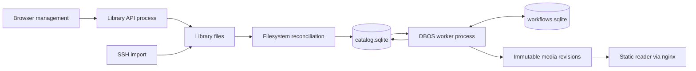

**Durable application architecture**

The service runs Python with two local SQLite databases and DBOS 3.0.0. The
reader remains a static site with its existing layout. This deployment supports
one processing worker on one host; an exclusive process lock enforces that rule.
The databases must be on local storage. DBOS supports SQLite, although its
[documentation](https://docs.dbos.dev/python/tutorials/database-connection)
recommends PostgreSQL for distributed production deployments.



The catalog owns lesson identity, source identity, build intent, and the last
published lesson. DBOS owns scheduling, step checkpoints, recovery attempts, and
workflow outcomes. Catalog build status is a projection for the application UI,
not a second scheduler. The catalog records a random build ID before enqueueing;
the same ID is the DBOS workflow ID. Reconciliation can safely retry enqueueing
after a crash between the two database commits.

Each lesson revision has one workflow. It checkpoints source preparation, probe,
transcription, scenes, instructions, assets, assembly, and publication. The
ordinary `build` command uses those same stage callbacks without DBOS. Only the
`watch` service supplies the durable runner.

Workflow inputs contain a snapshot of processing settings and the source digest.
File operations, model calls, and catalog changes happen inside steps. Network
failures and retryable API responses get up to three step attempts with backoff.
Invalid input and local processing errors fail that lesson and remain available
for explicit retry. DBOS limits crash recovery to three attempts. The next
lesson can proceed independently.

**Identity and artifacts**

Source size/mtime avoid hashing unchanged files on every scan. A changed or new
source is hashed with SHA-256. Its lesson UUID is independent of its filename,
title, and course. API renames preserve that UUID explicitly; external moves
preserve it when there is exactly one unambiguous matching missing source.
Identical copies imported together remain distinct lessons. External course
folder renames currently create a new course group while preserving matching
lesson IDs.

Before processing, the worker copies the source to an immutable snapshot and
verifies its digest. This costs additional disk space, but keeps active jobs and
published playback independent of subsequent overwrite, rename, or deletion.
The source snapshot is reused for later builds of the same bytes.

```text
library/                         user-managed source videos
state/catalog.sqlite             library metadata and build intent
state/workflows.sqlite           DBOS execution history and checkpoints
state/*.lock                     process/publication coordination
work/lessons/<id>/<digest>/       disposable stage caches
site/_sources/<digest>/           immutable source snapshots
site/.staging/<build-id>/         unpublished generated media
site/_revisions/<build-id>/       committed generated media
site/<course>/<lesson-id>.html    atomically replaced public pages
site/status.json                 current worker heartbeat and lesson status
```

Generation never overwrites media used by a published revision. Publication
validates generated references, renames the staging directory into place, commits
the desired lesson record, and atomically replaces public text files. Startup and
ongoing reconciliation repair an interruption between the catalog commit and
page generation. A canceled, removed, or superseded build cannot publish. The
previous published revision remains usable when its replacement fails.

Reading state is namespaced by lesson identity and instruction content. A rename
preserves it; changing instructions gives a new namespace so completion does not
silently attach to unrelated steps. This does not yet implement cross-device sync
or migrate ambiguous old slug-only localStorage keys.

**Running locally**

```sh
nix develop

# Terminal 1: durable worker, also creates the initial site.
v2w watch ./library -o ./site --work ./work --state ./.v2w-state --llm heuristic

# Terminal 2: static reader and management endpoints.
v2w serve ./site --library ./library --state ./.v2w-state

# Inspect jobs and use a lesson ID returned by the listing.
v2w jobs list --state ./.v2w-state
v2w jobs retry LESSON_ID --state ./.v2w-state
v2w jobs cancel LESSON_ID --state ./.v2w-state
```

Choose an LLM backend in place of `heuristic` for authored instructions. For a
separate API behind nginx, run
`v2w api ./library --state ./.v2w-state --port 8765`. The NixOS module now runs
`video-to-website` and `video-to-website-api` as separate services so processing
restarts do not terminate uploads. The optional `watch --api-port` convenience
mode still shares a process and does not have that isolation.

The homepage links to `queue.html`, which shows the full queue, positions,
processing stages, search, status filters, and per-lesson retry/cancel controls.
It reads the catalog directly through `GET /api/jobs`, retaining a read-only
`status.json` fallback when the API is unavailable. `GET /api/jobs`
returns the current job projection; `POST /api/lessons/<id>/retry` records a new
build intent and `POST /api/lessons/<id>/cancel` requests cancellation. ffmpeg and
Whisper subprocesses check cancellation while running and terminate their process
group. An in-flight synchronous LLM call may finish before cancellation takes
effect; its result cannot subsequently publish.

**Migration, maintenance, and boundaries**

- The first service scan imports existing files into the catalog. Matching old
  file caches are copied into the UUID cache namespace. Transcript and scene
  caches can be reused; changed dependency keys may require rewriting steps and
  assets. New public URLs use the new identities. Old generated pages are retained
  for manual migration and existing bookmarks; they are not redirected yet.
- Source snapshots and historical generated revisions are retained, including
  after library deletion. There is no automatic garbage collector yet. Deletion
  removes the original library file and current catalog pages; it is not a secure
  erase of every historical copy. The management page explains this. Plan disk
  capacity for snapshots and successive media revisions.
- Back up the original library **and state/**. These databases are no longer
  disposable caches. Stop both services before copying the databases and their
  sidecars, or use SQLite's backup API. Preserve `site/_sources`,
  `site/_revisions`, and `site/.staging` when recovering in-flight workflows:
  checkpoints can refer to those artifacts. If artifacts were deliberately
  discarded, request fresh builds instead of replaying old checkpoints.
- `PIPELINE_VERSION` identifies the workflow step sequence. Keep it stable for
  compatible edits and bump it for incompatible workflow changes. Incompatible
  pending jobs become actionable failures; explicit retry creates a new execution
  with the current code. Use DBOS patching/versioned workers if rolling upgrades
  are needed later.
- This is checkpoint recovery, not transparent process suspension: an interrupted
  Whisper invocation restarts its transcription step. External API calls can repeat
  if a crash happens before their result is checkpointed. Stage cache dependency
  hashes and immutable, idempotent writes remain necessary.
- Uploads remain single-request transfers without resume. Completion uses a unique
  temporary file and a locked destination check, while exact existing-name lookup
  avoids rewriting the target of a rename/delete request. Library reconciliation
  and API mutations share the catalog lock.
- Chapter editing, explicit ordering, search, bulk management, trash/restore,
  resumable uploads, and synchronized reading state remain future UI work.

Validation includes an actual DBOS worker killed after transcription, removal of
its transcript file cache, and restart against the same SQLite state. The recorded
step is recovered without another transcription call. Other integration checks
cover concurrent upload conflicts, failed replacement publication, source rename,
final deletion, source/configuration changes, API retry/cancel, and subprocess
cancellation. Media/LLM adapters are mocked in the crash tests so they require no
credentials, downloaded models, or paid requests.
