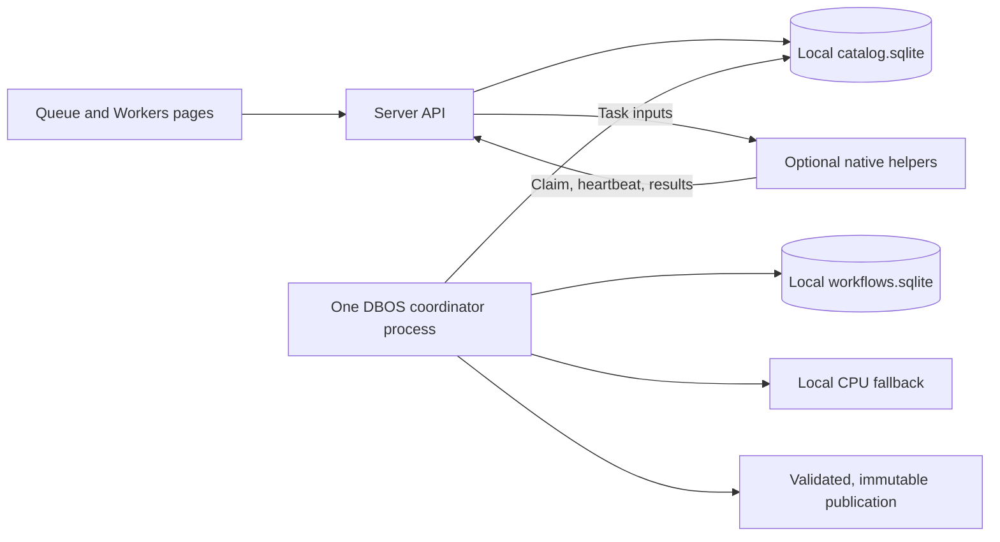

# Distributed processing workers

Optional native helpers accelerate the durable service while the server retains
the library and processes locally whenever helpers are unavailable. The standalone
`v2w build` command continues to process locally.

## Setup

On the computer you want to connect:

1. Open **Workers → Connect a computer** and choose Windows, macOS or Linux.
2. Download the small `.pyz` helper directly from your server. It contains all of
   the helper's Python code and requires Python **3.11 or newer**. There is no Git
   checkout, pip install, virtualenv or DBOS dependency on that computer.
3. Open a terminal in the download folder and run the page's **check** command.
   It uses `py -3` on Windows or `python3` on macOS/Linux and reports whether
   FFmpeg and Whisper are available. It does not pair or create application state.
4. If a native tool is missing, expand the page's installation instructions.
   Either FFmpeg (visual processing) or Whisper (transcription) is enough to
   contribute; installing both enables all helper operations.
5. Choose **Generate connection command** and run it. The single-use code expires
   after ten minutes; generating it after setup avoids expiring during installation.

The page supplies the exact filename and server URL. Keep the downloaded file;
the page also shows the short command to start it again using its saved identity.
Pairing codes and credentials are not embedded in the download.

FFmpeg and Whisper are native programs and are **not inside the Python download**.
For a Mac with Homebrew, the install command is
`brew install ffmpeg whisper.cpp` ([FFmpeg](https://formulae.brew.sh/formula/ffmpeg),
[Whisper](https://formulae.brew.sh/formula/whisper.cpp)). For Windows, the page links
to prebuilt binaries; no source checkout is needed. Keep executables and their
supporting DLLs together. You can put them in a `tools` folder (or `tools/bin`)
beside the `.pyz`; common extracted `bin` and `Release` subfolders are detected
automatically. Alternatively, add `--tools DIRECTORY` to the check/connection command.
Repeat `--tools` for separate folders. Explicit folders are saved for reconnects;
the helper only changes its own PATH, not your system configuration.

The file is built from the server's installed helper modules and has a name like
`v2w-worker-<build-hash>.pyz`. Download information and the HTTP response include
its SHA-256. After a server update, stop the helper, download the new file from
that server, and start it using the same state directory. Your identity, settings
and input cache are retained; you do not need to pair again unless access was
revoked. Different builds have different filenames, so browser downloads do not
silently select an older helper. The download itself never expires; pairing codes do.

If you already use this project through Nix, the existing packaged command is
also available and supplies the native tools:

```sh
nix run .#worker -- --server http://lessons --pairing-code CODE_FROM_THE_PAGE
nix run .#worker
```

For the **RTX 3090**, use a CUDA-enabled Whisper build and an FFmpeg build with
NVENC support. `--clip-encoder h264_nvenc` performs a real encoder smoke test at
startup using a 256×256 frame. Native checks finish before pairing, so a failed
encoder setup does not create a dead worker entry. A driver/build problem is
reported before taking work. WSL2 is another
way to run the Linux helper with NVIDIA acceleration; follow the
[NVIDIA WSL setup guide](https://docs.nvidia.com/cuda/wsl-user-guide/index.html).

For the **M3**, use a native macOS Whisper build with Metal support. `--device auto`
lets Whisper choose its native acceleration, while `--device cpu` explicitly
disables GPU inference. The initial release supports CPU and NVIDIA clip encoders;
an Apple VideoToolbox clip profile is future work. Metal transcription already
uses the same helper protocol.

The UI displays hardware identification, requested Whisper mode and clip encoder.
It does not claim measured GPU utilization. Confirm the actual Whisper backend
in the helper's native-tool logs when configuring a GPU build.

| Helper option | Default | Purpose |
| --- | --- | --- |
| `--state PATH` | `~/.v2w-worker` | Private credentials, input cache and scratch files |
| `--cache-gib N` | 20 | Input cache limit, including model weights |
| `--min-free-gib N` | 2 | Free disk space the helper preserves |
| `--device auto\|cpu` | auto | Native Whisper acceleration or explicitly CPU |
| `--clip-encoder libx264\|h264_nvenc` | libx264 | Helper encoder; NVENC is checked at startup |
| `--threads N` | Native default | Whisper thread count |
| `--check` | Off | Check installed tools and show guidance without pairing |
| `--tools DIRECTORY` | PATH / adjacent tools folder | Extra native executable folders; repeatable and saved |
| `--name NAME` | Hostname | Initial name, also editable in the UI |

Resource and acceleration settings are saved for subsequent starts. The first
transcription downloads the server's exact model weights as well as the audio;
later operations reuse verified inputs by digest. A video exceeding the helper's
cache limit falls back locally. Transfers show progress but currently restart
rather than resume after a broken connection.

The helper can run as a normal OS service/login task using the same command, user,
PATH and state directory. The website need not stay open. Stopping or sleeping a
helper releases its work through lease expiry. **Pause new tasks** lets the
current task finish; **Stop task and pause** returns it to the server. **Revoke
access** invalidates its credential; use a fresh pairing code to reconnect it.

Generating a new code and retrying against the same server reuses the installation's
saved identity, settings and contribution history. Keep using the same `--state`
directory. Fresh codes can reauthorize revoked or archived workers when the helper
still has its original credential; a reused old code cannot undo revocation.
Separate state directories or different server URLs represent separate installations;
workers are never merged merely because their computer names match.

## Archive and remove old workers

The Workers page defaults to **Current computers**. Use **Archive** to disconnect
and hide a worker while keeping its contribution history. Unfinished assignments
return to local processing. Choose **Archived computers** or **All computers
including archived** to find it again. **Restore to list** unhides the entry but
keeps access revoked until a fresh pairing code is used.

**Delete worker… → Delete permanently** removes its registration, credentials on
the server, and contribution records. Revoked workers have these controls too.
Your library, published lessons, and other workers' contributions are kept. A
deleted helper must use a fresh pairing code before it can reconnect.

Deletion is blocked while an unfinished current lesson still needs that worker's
active assignment or saved result for recovery. Archive it instead, or complete
or retry the lesson before deleting its history. Temporary transfer copies are
removed on deletion where possible; the maintenance pass collects leftover copies.
Published media and logical lesson/workflow records have their own retention.

After deploying this update, download the new helper for the encoder and identity
fixes. Existing saved credentials and settings can be reused. No automatic merging
or deletion is performed on older duplicate entries; choose which entries to keep
from the Workers page.

## Server settings

Existing `v2w watch` plus `v2w api`/`v2w serve` installations gain the Workers page
and helper API. Both processes must use the same local application state
directory. No extra database or broker service is needed.

The NixOS module enables `services.video-to-website.workers` by default. Set it to
false to disable helper endpoints. `uploads = false` can be used independently:
the API still runs for helpers but refuses library mutations. For manual APIs,
`--no-workers` and `--no-uploads` provide the same controls. Disable both NixOS
options to disable all management APIs.

The pipeline's `--clip-encoder auto` permits a helper's configured encoder and
uses `libx264` locally. `--clip-encoder libx264` requires that CPU profile on every
machine. NVENC CQ and libx264 CRF are different quality controls, so file sizes and
appearance may differ. Encoding policy/profile version is in the asset cache key;
the actual encoder is recorded in contribution metadata. An `auto` cache permits
either profile and does not regenerate finished media simply because a helper joins.

## Product contract

The server owns the library, website, application catalog, and DBOS history.
Helpers are optional accelerators. With no available helper, the server uses its
existing local processing tools. A helper joining affects subsequent operations;
work already running locally is not interrupted just to move it elsewhere.

Helpers run native Python, Whisper and FFmpeg on macOS, Linux, or Windows. They
make outbound HTTP requests to the server. The browser manages workers through
the server; it does not need to remain open during processing.



## Execution and recovery

- DBOS continues to own lesson workflows and stage checkpoints. A small task
  broker inside the catalog owns individual native-tool assignments, leases and
  accepted results. Helpers never run DBOS or open either SQLite database.
- Offload transcription, scene analysis, screenshot selection/extraction, motion
  analysis and clip encoding. Source preparation, lesson writing and publication
  remain on the server. The same native functions serve local and remote work.
- Each logical task has a stable identity derived from its build, stage, input
  hashes and operation parameters. Each execution attempt has a separate ID.
  Only the current, unexpired attempt may submit progress or results.
- An unclaimed task promptly falls back locally. A disconnected, failed or
  revoked helper loses its lease; that task becomes local fallback work. Fallback
  may wait for the server's CPU slot. A new remote attempt does not repeatedly
  delay local recovery. A returning helper can claim later tasks.
- Heartbeats describe liveness separately from processing progress. A silent
  native tool cannot extend its execution indefinitely through heartbeats alone.
  Progress and estimates reset when execution restarts on another machine.
- Cancellation and supersession invalidate assignments. Late or duplicate
  responses cannot overwrite accepted results or publish an obsolete lesson.
- Accepted remote results are persisted before DBOS records the step result.
  Replay reuses them after a coordinator restart. Interrupted native invocations
  restart; the feature does not migrate an in-memory Whisper/FFmpeg process.
- The coordinator permits one workflow without helpers, otherwise one plus the
  available helper count, capped at four. Lowering that limit does not kill active
  workflows. Expensive local work is limited to one operation, with a separate
  single slot for source preparation, probing and audio extraction so a long
  local transcription cannot starve helpers. Model requests are limited to one.
  Each helper accepts one operation at a time. Media generation within a lesson
  uses the bounded batch described below.

### Keeping faster helpers supplied

During media generation, each lesson offers up to **eight independent media
jobs**: a screenshot gallery and a clip for each step, when requested. A completed
job immediately makes room for another, even if an earlier step is still running
on a slower computer. With up to four active lessons, at most 32 media jobs are
admitted across the coordinator. When no suitable media helper is available,
only one job is admitted per lesson; the window expands if a helper joins later.
Already admitted work drains normally if helpers leave.

Each gallery retains sequential perceptual-hash comparisons so screenshot choice
and order remain deterministic. Each clip's motion analysis finishes before its
encoding. Galleries and clips are independent of one another, including within
the same step. Helpers continue to claim individual native operations from the
shared queue, so a faster helper can complete many operations while another is
still busy. There is no round-robin quota or reservation of a whole lesson to one
computer. Already-running operations are not preempted.

The server still runs only one expensive native operation plus one preparation
operation at a time, and each helper still accepts one operation. Batch threads
coordinate waiting and transfers; they do not grant extra local encoder slots.
Only native execution/cancellation context reaches those threads. DBOS's workflow
context stays on the parent thread, which collects results in lesson order and
publishes only when every requested media job has completed.

The queue lists all participating computers with step descriptions and the number
of ready operations. Lesson progress counts completed **media jobs** across the
batch; the Workers page retains each native operation's own progress and estimate.
Accepted native results survive recovery inside an unfinished DBOS media stage.
A failed/cancelled batch releases unfinished assignments; a coordinator shutdown
keeps valid remote leases so helpers can finish while it restarts.

This is a server update: the existing helper protocol and native operations are
unchanged. No helper update or re-pairing is required for batching. The DBOS stage
sequence, native task identities, and asset cache keys are unchanged, so enabling
it does not rebuild completed lessons. Transcription and scene detection still
operate on a whole source video; this change does not split a transcript across
machines or rank helpers by benchmark speed.

| Timing | Current value |
| --- | --- |
| Helper heartbeat | Every 5 seconds |
| Assignment lease / offline threshold | 30 seconds without renewal |
| Helper stops when renewal is unavailable | After 25 seconds |
| Initial opportunity to claim before idle CPU fallback | Up to 2.5 seconds; no wait without an eligible helper |
| Work waiting for a busy CPU | Remains claimable until local execution starts |
| Helper task deadline, including transfer | 2 hours |
| Cooldown after a helper processing error | 60 seconds; Resume can clear it |
| Browser refresh | Every 3 seconds |

Both API and coordinator expire stale assignments. Heartbeats cannot extend the
two-hour task deadline. The server sends relative leases and timestamps progress,
so helper clock offsets do not determine ownership. A partition can briefly leave
two physical computations running; only the current fenced attempt can contribute
an accepted result. Exactly-once acceptance/counting does not imply exactly-once
execution of every native command.

## Files, capabilities and admission

Helpers download only task inputs: extracted audio for transcription, and a
video snapshot for visual operations. Model weights and source files are cached
by content digest. Cache size and minimum free space are bounded locally.
Originals and published outputs remain on the server.

Transfers use opaque task/input identifiers, declared sizes, checksums, and
attempt-specific temporary files. Helpers cannot choose server filesystem paths.
Artifact uploads reserve server disk space using the existing storage admission
mechanism. A full disk is reported as a storage problem; moving compute cannot
fix it. A server storage rejection fails the lesson with the capacity error
without repeating expensive work locally. A helper's own storage problem can
fall back to the server.

Accepted transfer artifacts live under `state/worker-results/` until copied to
normal stage output. They remain available while a build is active, including
across replay. Maintenance removes failed/interrupted attempt artifacts; terminal
build copies are eligible after 24 hours. Unreferenced uploads are collected after
one hour. Contribution records stay in SQLite. Published media/source retention
is separate from these transfer copies.

Helper input caches persist across starts and evict least recently used files.
Current inputs are pinned. Scratch files are deleted after completion/failure;
startup under the helper lock removes abandoned task scratch files and incomplete
input downloads. Treat `--state` as an application directory, not a folder shared
with unrelated files.

Capability matching includes the operation and encoding policy. GPU support
depends on installed native binaries/drivers. A requested GPU is not presented
as measured GPU utilization. CPU processing is always a valid fallback.

Worker credentials are unique, revocable and stored hashed on the server. Initial
pairing uses a short-lived, single-use code. Worker management retains the
existing trusted home-network management boundary; this does not add user login.
Use HTTPS or a private encrypted network when connecting across networks.

## Interface

Add a Workers page alongside Library, Add videos and Task queue. Show the server
as the permanent local worker, then each paired helper with:

- Display name, platform, capabilities, last contact and availability.
- Current lesson, operation, transfer/processing progress and elapsed time.
- Pause after current task, resume, stop current work and return it to the server,
  rename, revoke, archive/restore and permanent deletion controls. Offline records
  remain visible; archived records are hidden from the default view.
- Accepted task counts, transcription media duration, active processing time,
  failed/interrupted attempts and recent contribution history.

Count accepted results once, even when acknowledgements are retried. Label task
counts as tasks, not completed lessons. Keep interrupted effort separate from
successful contributions. Do not invent a “time saved” estimate without a
comparable local benchmark.

Queue entries show their current machine, whether they are transferring or
processing, and why they fell back. Keep progress accessible with text and
indeterminate bars where totals are unknown. A stale API response must not imply
that every machine is offline or leave management controls enabled.

## Implementation and protocol

| Component | Responsibility |
| --- | --- |
| `compute.py` | Native operation registry and scoped execution boundary |
| `distributed.py` | Prefer helpers, restore accepted outputs, fall back locally |
| `media_batch.py` | Bounded media scheduling, cancellation and aggregate progress |
| `worker_store.py` | Worker metadata, pairing, leases, acceptance, statistics, maintenance |
| `worker_api.py` | Authenticated task protocol and bounded transfers |
| `worker.py` / `v2w-worker` | Native helper, caching, heartbeats, cancellation |
| `worker_bundle.py` | Reproducible helper download from an explicit module allowlist |
| `worker_protocol.py`, `worker_setup.py` | Shared constants and native-tool checks/guidance |
| `durable.py` | One DBOS host, resource limits, independent server heartbeat |
| `workers.js`, `render.py`, `queue.js` | Management page and queue attribution |

Schema v4 adds `workers`, `worker_pairing`, `compute_tasks` and `compute_attempts`.
Schema v5 adds the worker archive flag without changing identities or existing
contributions. Permanent deletion checks recovery references in the same database
transaction as removing the worker and its contribution records.
The existing DBOS step sequence remains intact. Protocol version 1 is checked
during heartbeats; incompatible helpers cannot renew assignments. Changes to
operation parameter/result contracts require a protocol revision.

| Endpoint | Purpose |
| --- | --- |
| `GET /api/workers` | Fleet status, tasks, totals and recent history |
| `GET /api/workers/download-info` | Filename, SHA-256, size, Python requirement and platform guidance |
| `GET /api/workers/download` | Python helper archive; optional `sha256` query refuses an outdated download link |
| `POST /api/workers/pairing` | Create a single-use pairing code |
| `POST /api/workers/<id>` | Rename, pause, resume, stop, revoke, archive, restore, delete |
| `POST /api/worker/pair` | Exchange code plus helper-generated identity/secret |
| `POST /api/worker/heartbeat` | Report capabilities and renew an attempt |
| `POST /api/worker/claim` | Atomically claim a compatible task or return none |
| `GET /api/worker/attempts/<id>/inputs/<name>` | Stream an assigned immutable input |
| `POST /api/worker/attempts/<id>/progress` | Report measured progress |
| `PUT /api/worker/attempts/<id>/artifact` | Upload bytes with size and SHA-256 |
| `POST /api/worker/attempts/<id>/complete` | Validate and accept idempotently |
| `POST /api/worker/attempts/<id>/fail` | Report helper/server-storage failure |

Worker endpoints require the helper's bearer token except initial pairing. The
helper download is available through the existing management API without pairing,
contains code only, and is disabled when worker endpoints are disabled. The
management endpoints retain the existing LAN trust boundary. Manifests contain
digests, sizes and suffixes, not server paths. Expired/foreign attempts receive
409, invalid credentials 401, malformed data 400 and exhausted server storage
507. Progress bodies are capped at 16 KiB, ordinary JSON at 32 KiB, result JSON at
16 MiB, and artifact uploads at the existing 16 GiB limit.

## Validation and limits

Tests cover competing claims, bounded assignments, controls, expired ownership,
cancellation, replay, idempotent completion, automatic fallback, helpers joining
while local compute is busy, saved settings, cache limits, checksums, foreign input
access, storage failure and protocol mismatch. An integration test runs two
helpers through the real HTTP API and DBOS pipeline with real FFmpeg outputs and
a deterministic Whisper test executable; both lessons publish and both helpers
receive contribution credit.

Browser-script tests and real Chrome checks cover progress, pairing, controls,
editing/focus preservation, offline history, stale responses, queue links, and
desktop/mobile layout.

The downloadable archive is also exercised with Python's isolated mode and site
packages disabled (`-I -S`), both for preflight checks and a real HTTP/native
processing task. Packaging tests verify the module allowlist and reproducible
bytes, and HTTP tests check versioned filenames, hashes, HEAD and disabled downloads.

Batch tests verify that a fast helper can complete 19 clip tasks while a slow
helper retains its first, that the admission window and local CPU bound hold,
and that parallel completion preserves screenshot deduplication and reading order.
A real DBOS process is killed within media generation and restarted to verify
that the completed clip is reused. A separate test publishes one lesson's clips
through two helpers with real FFmpeg.

This does not yet provide a tray application, installer/updater, battery/idle
schedules, GPU utilization sampling, resumable transfers, VideoToolbox encoding,
or splitting a single transcription across machines. Windows pipe handling has a portable
regression test, but the actual Windows/RTX 3090 installation and Metal/CUDA speed
require hardware validation. Benchmark a representative lesson with identical
model/settings, including first-use transfers and subsequent cached runs, before
making speedup claims.

The architecture retains one DBOS host because [DBOS's SQLite backend is local](https://docs.dbos.dev/python/tutorials/database-connection).
Native acceleration is provided by [whisper.cpp](https://github.com/ggml-org/whisper.cpp)
and [FFmpeg's NVIDIA support](https://docs.nvidia.com/video-technologies/video-codec-sdk/13.1/ffmpeg-with-nvidia-gpu/index.html).
